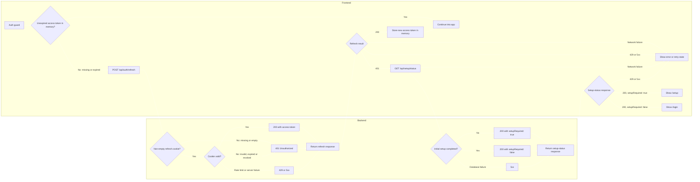

# Authentication and Setup Flow

The frontend should reuse an **unexpired access token** and call refresh only when it is missing or expired. Since the spec stores access tokens **in memory only**, a hard reload still takes the refresh path.

Refresh is responsible only for renewing an authenticated session. It does not determine whether initial setup is required. When refresh returns `401`, the frontend calls the separate unauthenticated `GET /api/setup/status` endpoint. That endpoint returns `setupRequired: true` when initial setup has not been completed and `false` otherwise.

An empty cookie value follows the missing-cookie path even if the cookie header is present. A non-empty but invalid, expired, or revoked refresh cookie cannot restore the session: refresh returns an ordinary `401`, after which the frontend queries `/api/setup/status` and shows `/setup` or `/login` accordingly. Network, rate-limit, and server failures from either request remain error/retry states, not login redirects.

The setup-status endpoint is informational only. The setup-creation endpoint must independently and atomically verify that setup is still allowed so that two clients cannot both create the initial administrator after observing `setupRequired: true`. Prefer tracking explicit setup completion state if the backend has such a mechanism; otherwise, the status endpoint can derive it from whether the `users` table is empty.

The token's local expiry check is only a frontend shortcut; the backend still validates it on protected requests.
