# Authentication and Setup Flow

The frontend should reuse an **unexpired access token** and call refresh only when it is missing or expired. Since the spec stores access tokens **in memory only**, a hard reload clears the access token. On page load, the frontend checks the JavaScript-readable `session_hint` cookie before trying refresh:

- **Logged in and reloading:** `session_hint=1` means call `POST /api/auth/refresh` to get a new access token. The hint does not save this request or its database work.
- **Logged out and reloading:** no hint means skip the refresh request that would only return `401`, then check setup status to choose the login or setup screen. This is the only request the hint saves.

The server sets `session_hint=1` alongside `refresh_token` on setup, login, and successful refresh, with matching 30-day expiry. The hint uses `Secure`, `SameSite=Strict`, and `Path=/`, without `HttpOnly`, so page JavaScript can read it. The actual refresh token stays `HttpOnly` at `Path=/api/auth`. The hint can be stale or edited; it never proves the user is logged in. Logout, current-session revocation, and refresh `401` clear both cookies using their original paths and `Max-Age=0`. Network failures, `429`, and `5xx` do not clear them. Revoking a session in another browser cannot clear that browser's cookies; its next refresh fails and clears them.

Refresh is responsible only for renewing an authenticated session. It does not determine whether initial setup is required. When there is no hint on page load, or refresh returns `401`, the frontend calls the separate unauthenticated `GET /api/setup` endpoint. That endpoint returns `setup_required: true` when initial setup has not been completed and `false` otherwise.

```mermaid
flowchart LR
    subgraph FRONTEND["Frontend"]
        A["Auth guard"] --> Q{"Unexpired access token in memory?"}
        Q --- Q_YES@{ shape: text, label: "Yes" } --> D["Continue into app"]
        Q --- Q_REFRESH@{ shape: text, label: "No: missing or expired" } --> K{"session_hint=1?"}
        K --- K_YES@{ shape: text, label: "Yes: try refresh" } --> B["POST /api/auth/refresh"]
        K --- K_NO@{ shape: text, label: "No: skip refresh" } --> P["GET /api/setup"]
        C{"Refresh result"} --- C_NETWORK@{ shape: text, label: "Network failure" } --> H["Show error or retry state"]
        C --- C_200@{ shape: text, label: "200" } --> S["Store new access token in memory"]
        S --> D
        C --- C_401@{ shape: text, label: "401" } --> P
        C --- C_ERROR@{ shape: text, label: "429 or 5xx" } --> H["Show error or retry state"]
        P --- P_NETWORK@{ shape: text, label: "Network failure" } --> H
        U{"Setup-status response"} --- U_SETUP@{ shape: text, label: "200, setup_required: true" } --> F["Show /setup"]
        U --- U_LOGIN@{ shape: text, label: "200, setup_required: false" } --> G["Show /login"]
        U --- U_ERROR@{ shape: text, label: "429 or 5xx" } --> H
    end

    subgraph BACKEND["Backend"]
        T{"Non-empty refresh cookie?"} --- T_YES@{ shape: text, label: "Yes" } --> V{"Cookie valid?"}
        T --- T_EMPTY@{ shape: text, label: "No: missing or empty" } --> R_UNAUTHORIZED["401; clear both cookies"]
        V --- V_YES@{ shape: text, label: "Yes" } --> R_SUCCESS["200 with access token; renew both cookies"]
        V --- V_INVALID@{ shape: text, label: "No: invalid, expired or revoked" } --> R_UNAUTHORIZED
        V --- V_ERROR@{ shape: text, label: "Rate limit or server failure" } --> R_ERROR["429 or 5xx"]
        R_SUCCESS --> R["Return refresh response"]
        R_UNAUTHORIZED --> R
        R_ERROR --> R

        N{"Initial setup completed?"}
        N --- N_NO@{ shape: text, label: "No" } --> ST_SETUP["200 with setup_required: true"]
        N --- N_YES@{ shape: text, label: "Yes" } --> ST_LOGIN["200 with setup_required: false"]
        N --- N_DATABASE@{ shape: text, label: "Database failure" } --> ST_ERROR["5xx"]
        ST_SETUP --> SR["Return setup-status response"]
        ST_LOGIN --> SR
        ST_ERROR --> SR
    end

    B --> T
    R --> C
    P --> N
    SR --> U

    linkStyle default stroke:white;
```

An empty cookie value follows the missing-cookie path even if the cookie header is present; the server returns `401` before any database query. A non-empty but invalid, expired, or revoked refresh cookie cannot restore the session: refresh returns an ordinary `401`, after which the frontend queries `/api/setup` and shows `/setup` or `/login` accordingly. Network, rate-limit, and server failures from either request remain error/retry states, not login redirects.

The setup-status endpoint is informational only. The setup-creation endpoint must independently and atomically verify that setup is still allowed so that two clients cannot both create the initial administrator after observing `setup_required: true`. Prefer tracking explicit setup completion state if the backend has such a mechanism; otherwise, the status endpoint can derive it from whether the `users` table is empty.

The token's local expiry check is only a frontend shortcut; the backend still validates it on protected requests.
