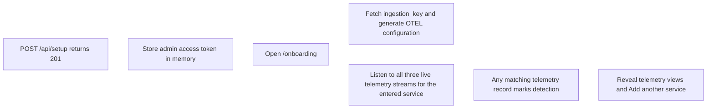

# Authentication and Setup Flow

The frontend should reuse an **unexpired access token** and call refresh only when it is missing or expired. Since the spec stores access tokens **in memory only**, a hard reload clears the access token. On page load, the frontend checks the JavaScript-readable `session_hint` cookie before trying refresh:

- **Logged in and reloading:** `session_hint=1` means call `POST /api/auth/refresh` to get a new access token. The hint does not save this request or its database work.
- **Logged out and reloading:** no hint means skip the refresh request that would only return `401`, then check setup status to choose the login or setup screen. This is the only request the hint saves.

The server sets `session_hint=1` alongside `refresh_token` on setup, login, and successful refresh, with matching 30-day expiry. The hint uses `Secure`, `SameSite=Strict`, and `Path=/`, without `HttpOnly`, so page JavaScript can read it. The actual refresh token stays `HttpOnly` at `Path=/api/auth`. The hint can be stale or edited; it never proves the user is logged in. Logout, current-session revocation, and refresh `401` clear both cookies using their original paths and `Max-Age=0`. Network failures, `429`, and `5xx` do not clear them. Revoking a session in another browser cannot clear that browser's cookies; its next refresh fails and clears them.

Refresh is responsible only for renewing an authenticated session. It does not determine whether initial setup is required. When there is no hint on page load, or refresh returns `401`, the frontend calls the separate unauthenticated `GET /api/setup` endpoint. On every request, that endpoint queries `countByRole(ADMIN)` and returns the raw JSON boolean `true` when the count is zero and `false` otherwise. Existing non-admin users do not prevent setup; any current admin, including the persisted API-key user, does. It uses neither a startup cache nor an explicit setup-completion flag.

An empty cookie value follows the missing-cookie path even if the cookie header is present; the server returns `401` before any database query. A non-empty but invalid, expired, or revoked refresh cookie cannot restore the session: refresh returns an ordinary `401`, after which the frontend queries `/api/setup` and shows `/setup` or `/login` accordingly. Network, rate-limit, and server failures from either request remain error/retry states, not login redirects.

The setup-status endpoint is informational only. First-admin creation is serialized in-process; the setup-creation endpoint independently checks `countByRole(ADMIN) == 0` inside its creation transaction and atomically inserts the initial users so that two clients cannot both create the initial administrator after observing `true`. A nonzero admin count returns `409` with `{ message: 'setup already completed' }`. Neither endpoint checks whether any user exists or relies on cached startup state.

Successful first-admin setup atomically creates two `users` rows: the human admin from the submitted credentials and a separate API-key user with email `mustbe@api.email`, a cryptographically random password stored only as a salted bcrypt hash, and role `admin` (`ADMIN` authority). That email is reserved from the human setup input. The generated password is never returned or logged; the setup response tokens and cookies belong only to the human admin. API-key authentication acts as the persisted default user, not a roleless admin bypass. The user is created during setup, not during startup key generation.

Rate-limit responses put both the reason and retry delay in one message: `rate limited; retry in <seconds> seconds`, with the wait rounded up to whole seconds. HTTP `429` returns `{ message: 'rate limited; retry in <seconds> seconds' }`; WebSocket rate-limit errors use a `message` field and leave the connection open. Neither uses a separate retry field, and HTTP does not send a `Retry-After` header.

All custom HTTP exception responses consistently use the JSON object `{ message: '<message>' }`, including validation (`400`), authentication (`401`), authorization (`403`), not-found (`404`), conflict (`409`), rate-limit (`429`), and server errors (`5xx`). Do not return an `error` field, a raw string, a field-error map, or a timestamp/status/path context envelope. Successful response bodies, including the setup-status boolean, and cookie-clearing behavior are unchanged.

## After successful first-admin creation

- `/onboarding` is an authenticated admin page; admins may revisit it. Reload restores the session through the existing guard and stays on onboarding. No persisted onboarding-completion flag is introduced.
- `setupRequired` becomes false when account creation commits because admins now exist, not when telemetry arrives. Waiting, resetting, or leaving onboarding never changes setup eligibility. If all ADMIN users are later removed or demoted, the next setup-status request returns true.
- `GET /api/config/keys` uses the admin access token. Only `ingestion_key` is embedded in the application's OTLP configuration; missing keys or request failures block configuration copying with no demo-key fallback.
- Open `/api/telemetry/traces/live`, `/api/telemetry/logs/live`, and `/api/telemetry/metrics/live` concurrently with `?name=<encodedServiceName>&token=<encodedAccessToken>`. The live `name` filter identifies OTel `service.name`; `service` remains a compatible alias. Never use the ingestion key for these reads.
- Monitoring starts independently of configuration copying and key loading. Remain waiting until an actual record for the active name arrives on any stream. Heartbeats, open events, empty payloads and stale callbacks do not count. Delivery is best-effort without replay, so users may need to generate more activity after reconnecting.
- At access-token expiry, close streams and use one coordinated refresh, not three competing requests. Reopen only the active session with the new token. Native EventSource errors do not reveal HTTP statuses; do not treat every connection failure as a 401. Coordinate reconnect backoff because each stream opening consumes the shared rate-limit budget.
- Success reveals `/traces?service=<encodedServiceName>`, `/logs?service=<encodedServiceName>`, `/metrics?service=<encodedServiceName>`, and Add another service. Reset cancels streams/retries, invalidates old callbacks, clears inputs and success state, restores the default address, retains the deployment key, and focuses the empty service input. A new non-empty name starts a fresh waiting session. Leaving the page also cleans up streams and retries.

The token's local expiry check is only a frontend shortcut. On every JWT-authenticated request, the backend validates the token signature and expiry, then loads the current database user identified by its subject. If that user has been deleted, authentication immediately returns `401` with `{ message: 'unauthorized' }`, even if the token is unexpired. Authorization uses the user's current database role, not a role claim embedded in the JWT; role changes apply on the next request without waiting for token expiry. An existing authenticated user whose current role does not permit the operation receives `403`.
